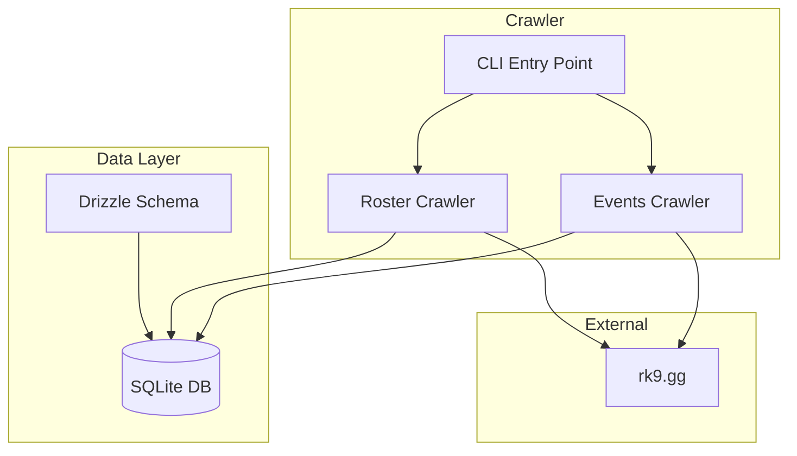
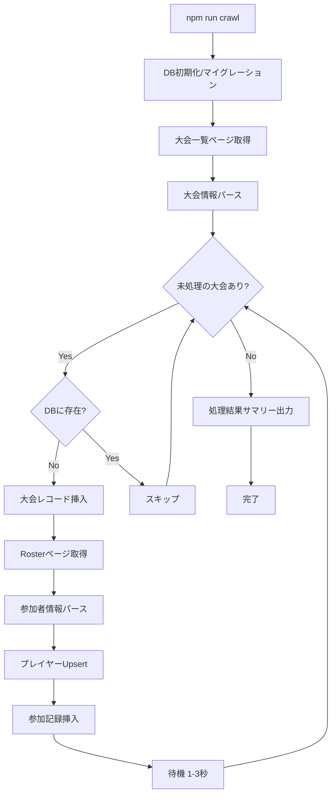
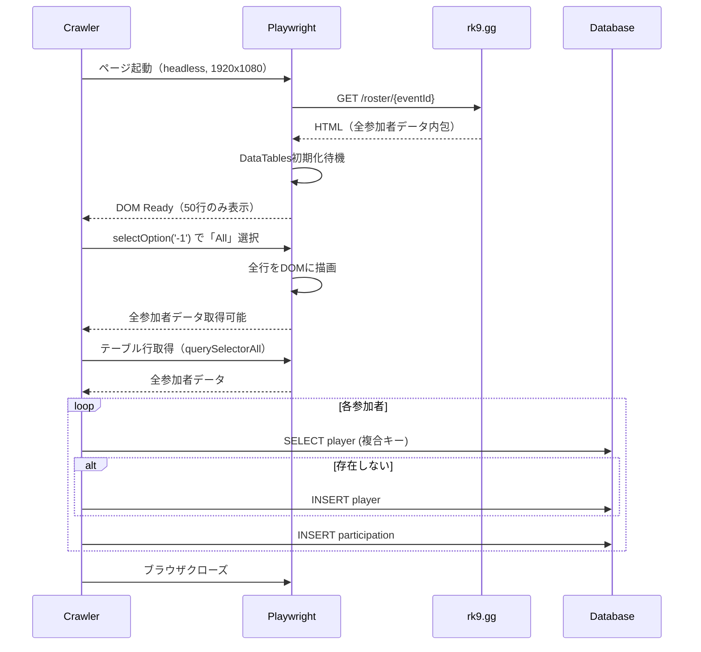
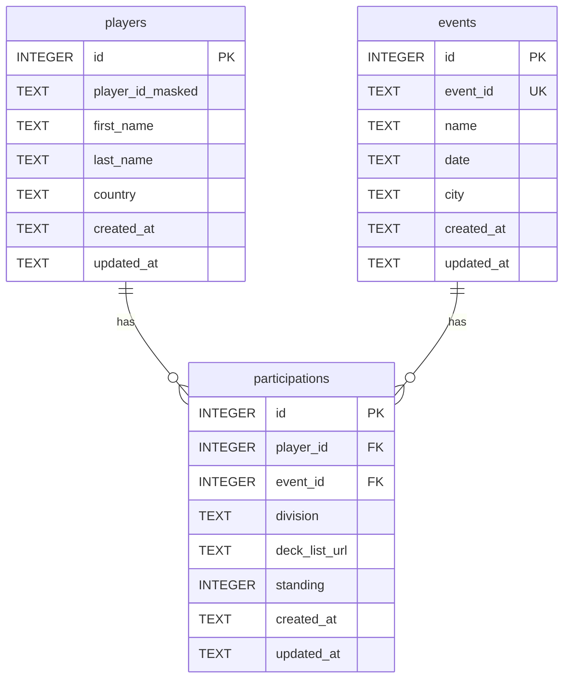

# Technical Design Document

## Overview

**Purpose**: rk9.ggからポケモンカード大会データを収集・保存する基盤システムを提供し、Phase 2以降の検索機能・Web UIのデータ層を確立する。

**Users**: 開発者がクローラーを実行してデータを収集し、将来的にはエンドユーザーが対戦相手のデッキ履歴を検索できるようになる。

**Impact**: 新規プロジェクトとしてゼロから構築。rk9.ggの公開データを構造化してローカルDBに保存する。

### Goals
- TypeScript + Node.jsによる型安全なクローラー実装
- SQLite + Drizzle ORMによる永続化層の構築
- 大会一覧・参加者情報の差分更新対応クローリング
- 将来の検索機能に対応したデータモデル設計

### Non-Goals
- Web UI（Phase 2で実装）
- 検索API（Phase 2で実装）
- リアルタイムデータ同期
- 認証・認可機能

---

## Architecture

### High-Level Architecture



### Technology Stack

| レイヤー | 技術 | 理由 |
|---------|------|------|
| 言語 | TypeScript 5.x | 型安全性、IDE補完、エラー防止 |
| ランタイム | Node.js 20 LTS | 安定性、長期サポート |
| クローラー | Playwright | DataTables対応、auto-waiting、信頼性 |
| ORM | Drizzle ORM | 型安全、軽量、SQLite最適化 |
| DB | SQLite (better-sqlite3) | セットアップ不要、同期API、高速 |

### Key Design Decisions

#### Decision 1: Playwright vs Puppeteer

- **Decision**: PlaywrightをWebクローラーとして採用
- **Context**: rk9.ggはDataTablesでJavaScript生成コンテンツを表示
- **Alternatives**: Puppeteer、Cheerio + fetch
- **Selected Approach**: Playwrightのauto-waiting機能でDOM安定を待機
- **Rationale**: Microsoftによる活発な開発、クロスブラウザ対応、エラーハンドリングが優秀
- **Trade-offs**: Puppeteerより若干重いが、安定性と機能性で優位

#### Decision 2: Drizzle ORM vs Prisma vs raw SQL

- **Decision**: Drizzle ORMを採用
- **Context**: 型安全なDB操作と軽量さの両立が必要
- **Alternatives**: Prisma（重い）、better-sqlite3直接（型安全性なし）
- **Selected Approach**: Drizzle + better-sqlite3の組み合わせ
- **Rationale**: TypeScript-firstで型推論が強力、SQLiteに最適化、軽量
- **Trade-offs**: Prismaより機能は少ないが、このプロジェクトには十分

#### Decision 3: プレイヤー識別の複合キー

- **Decision**: (player_id_masked, first_name, last_name, country) の4項目複合キー
- **Context**: Player IDが部分マスク（例: "2....5"）されており単独では識別不可
- **Alternatives**: 名前のみ、Player ID + 名前
- **Selected Approach**: 4項目全一致で同一人物判定
- **Rationale**: 同姓同名でも国・マスクIDが違えば別人として扱える
- **Trade-offs**: 同姓同名・同国籍・同マスクIDの別人は区別不可（稀なケース）

---

## System Flows

### クローリング全体フロー



### Rosterデータ取得フロー



**重要**: 初期状態ではDOMに50行のみ。`selectOption('-1')`で「All」を選択して全件取得が必要。

---

## Requirements Traceability

| Req | 概要 | Components | Interfaces |
|-----|------|------------|------------|
| 1 | プロジェクト基盤 | package.json, tsconfig.json | npm scripts |
| 2 | DBスキーマ | schema.ts, db/index.ts | Drizzle Schema |
| 3 | 大会一覧クローラー | crawler/events.ts | EventsCrawler |
| 4 | Rosterクローラー | crawler/roster.ts | RosterCrawler |
| 5 | 実行管理 | index.ts | CLI Commands |
| 6 | データ整合性 | schema.ts (FK, UNIQUE) | DB Constraints |
| 7 | 技術検証 | spike/ | - |

---

## Components and Interfaces

### Data Layer

#### Database Connection (`src/db/index.ts`)

**Responsibility & Boundaries**
- **Primary Responsibility**: SQLiteデータベース接続の初期化と提供
- **Domain Boundary**: データアクセス層
- **Data Ownership**: DB接続インスタンス

**Dependencies**
- **Outbound**: better-sqlite3, drizzle-orm

**Contract Definition**

```typescript
interface DatabaseConnection {
  db: BetterSqlite3Database;

  // マイグレーション実行
  migrate(): Promise<void>;

  // 接続クローズ
  close(): void;
}
```

#### Schema Definition (`src/db/schema.ts`)

**Responsibility & Boundaries**
- **Primary Responsibility**: Drizzle ORMスキーマ定義
- **Data Ownership**: events, players, participationsテーブル定義

**Contract Definition**

```typescript
// Events Table
interface Event {
  id: number;
  eventId: string;      // rk9の大会ID（UNIQUE）
  name: string;
  date: string | null;
  city: string | null;
  createdAt: string;
  updatedAt: string;
}

// Players Table
interface Player {
  id: number;
  playerIdMasked: string;  // 例: "2....5"
  firstName: string;
  lastName: string;
  country: string;
  createdAt: string;
  updatedAt: string;
}
// UNIQUE(playerIdMasked, firstName, lastName, country)

// Participations Table
interface Participation {
  id: number;
  playerId: number;      // FK → players.id
  eventId: number;       // FK → events.id
  division: string | null;
  deckListUrl: string | null;
  standing: number | null;
  createdAt: string;
  updatedAt: string;
}
// UNIQUE(playerId, eventId)
```

---

### Crawler Layer

#### Events Crawler (`src/crawler/events.ts`)

**Responsibility & Boundaries**
- **Primary Responsibility**: rk9.ggから大会一覧を取得してDBに保存
- **Domain Boundary**: 外部データ取得

**Dependencies**
- **Outbound**: Playwright, Database

**Contract Definition**

```typescript
interface EventsCrawlerService {
  // 全大会を取得してDBに保存
  crawlAllEvents(): Promise<CrawlResult>;

  // 新規大会のみ取得（差分更新）
  crawlNewEvents(): Promise<CrawlResult>;
}

interface CrawlResult {
  eventsAdded: number;
  eventsSkipped: number;
  errors: CrawlError[];
}

interface CrawlError {
  eventId: string;
  message: string;
  timestamp: string;
}

interface ParsedEvent {
  eventId: string;
  name: string;
  date: string | null;
  city: string | null;
}
```

**Preconditions**: DB接続が確立済み
**Postconditions**: 取得した大会がDBに保存される
**Invariants**: 既存の大会レコードは更新されない（スキップ）

#### Roster Crawler (`src/crawler/roster.ts`)

**Responsibility & Boundaries**
- **Primary Responsibility**: 各大会の参加者情報を取得してDBに保存
- **Domain Boundary**: 外部データ取得

**Dependencies**
- **Outbound**: Playwright, Database

**Contract Definition**

```typescript
interface RosterCrawlerService {
  // 指定大会の参加者を取得
  crawlRoster(eventId: string): Promise<RosterCrawlResult>;

  // 複数大会の参加者を順次取得
  crawlRosters(eventIds: string[]): Promise<RosterCrawlResult[]>;
}

interface RosterCrawlResult {
  eventId: string;
  playersAdded: number;
  playersReused: number;
  participationsAdded: number;
  errors: CrawlError[];
}

interface ParsedParticipant {
  playerIdMasked: string;
  firstName: string;
  lastName: string;
  country: string;
  division: string | null;
  deckListUrl: string | null;
  standing: number | null;
}
```

**Preconditions**: 対象eventIdがeventsテーブルに存在
**Postconditions**: 参加者がplayers/participationsに保存される
**Invariants**: 同一(player, event)の重複participationは作成されない

---

### CLI Layer

#### Main Entry Point (`src/index.ts`)

**Responsibility & Boundaries**
- **Primary Responsibility**: CLIコマンドの解析と実行フロー制御
- **Domain Boundary**: アプリケーションエントリ

**Dependencies**
- **Outbound**: EventsCrawler, RosterCrawler, Database

**Contract Definition**

```typescript
// npm run crawl
// npm run crawl:update

interface CrawlerCLI {
  // 全件クローリング実行
  runFullCrawl(): Promise<CrawlSummary>;

  // 差分クローリング実行
  runUpdateCrawl(): Promise<CrawlSummary>;
}

interface CrawlSummary {
  totalEventsProcessed: number;
  newEventsAdded: number;
  newPlayersAdded: number;
  newParticipationsAdded: number;
  totalErrors: number;
  duration: number;  // ms
}
```

---

## Data Models

### Physical Data Model (SQLite)



### Index Strategy

| テーブル | インデックス | 用途 |
|---------|-------------|------|
| events | event_id (UNIQUE) | 重複チェック、検索 |
| players | (player_id_masked, first_name, last_name, country) UNIQUE | 同一人物判定 |
| players | (first_name, last_name) | 名前検索（Phase 2用） |
| participations | (player_id, event_id) UNIQUE | 重複防止 |
| participations | player_id | プレイヤー別履歴取得 |

---

## Error Handling

### Error Strategy

| エラー種別 | 対応 | 継続可否 |
|-----------|------|---------|
| ネットワークエラー | リトライ（3回）、ログ出力 | 継続 |
| ページ構造変更 | エラーログ、スキップ | 継続 |
| DB接続エラー | 致命的エラーとして終了 | 停止 |
| データパースエラー | 該当レコードスキップ、ログ出力 | 継続 |
| レートリミット検出 | 待機時間延長、リトライ | 継続 |

### Error Categories

```typescript
type CrawlerErrorType =
  | 'NETWORK_ERROR'      // 接続失敗
  | 'PARSE_ERROR'        // HTMLパース失敗
  | 'TIMEOUT_ERROR'      // ページ読み込みタイムアウト
  | 'DATABASE_ERROR'     // DB操作失敗
  | 'RATE_LIMIT_ERROR';  // レートリミット検出

interface CrawlerError {
  type: CrawlerErrorType;
  message: string;
  eventId?: string;
  timestamp: string;
  retryable: boolean;
}
```

---

## Testing Strategy

### Unit Tests
- **Schema Validation**: Drizzleスキーマの型チェック
- **Parser Functions**: HTML→ParsedEvent/ParsedParticipant変換
- **Player Identification**: 複合キーによる同一人物判定ロジック

### Integration Tests
- **DB Operations**: CRUD操作、UNIQUE制約、FK制約
- **Crawler + DB**: クロール結果のDB保存
- **Upsert Logic**: 既存プレイヤーの再利用

### E2E Tests（手動）
- **Full Crawl**: 実際のrk9.ggからの全件取得
- **Update Crawl**: 差分更新の動作確認
- **Edge Cases**: デッキリストなし、順位なし、特殊文字名

---

## Project Structure

```
PTCGOpponentChecker/
├── src/
│   ├── index.ts              # CLIエントリポイント
│   ├── crawler/
│   │   ├── events.ts         # 大会一覧クローラー
│   │   ├── roster.ts         # Rosterクローラー
│   │   ├── parser.ts         # HTMLパーサー
│   │   └── types.ts          # クローラー型定義
│   ├── db/
│   │   ├── index.ts          # DB接続
│   │   ├── schema.ts         # Drizzleスキーマ
│   │   └── operations.ts     # DB操作ヘルパー
│   └── utils/
│       ├── logger.ts         # ロギング
│       └── sleep.ts          # 待機ユーティリティ
├── data/
│   └── ptcg.db               # SQLiteファイル
├── drizzle/                  # マイグレーションファイル
├── spike/                    # 技術検証スクリプト
├── package.json
├── tsconfig.json
├── drizzle.config.ts
└── CLAUDE.md
```

---

## 技術検証結果（Spike）

### 検証ドキュメント

| Task | ドキュメント | ステータス |
|------|-------------|-----------|
| 1.1 大会一覧ページ | [docs/spike-results/events-structure.md](../../../spike-results/events-structure.md) | 完了 |
| 1.2 Rosterページ | [docs/spike-results/roster-structure.md](../../../spike-results/roster-structure.md) | 完了 |
| 1.3 エッジケース | [docs/spike-results/edge-cases.md](../../../spike-results/edge-cases.md) | 完了 |

### 検証済みセレクタ

#### 大会一覧ページ (`/events/pokemon`)

```typescript
// テーブル
const PAST_EVENTS_TABLE = '#dtPastEvents';
const UPCOMING_EVENTS_TABLE = '#dtUpcomingEvents';

// TCG大会リンク（行内でテキストが"TCG"のaタグ）
const TCG_LINK_SELECTOR = 'td:nth-child(5) a'; // textContent === 'TCG'

// 大会ID抽出パターン
const EVENT_ID_PATTERN = /\/tournament\/([A-Za-z0-9]+)/;
```

#### Rosterページ (`/roster/{eventId}`)

```typescript
// viewport設定（Standingカラム表示のため必須）
const VIEWPORT = { width: 1920, height: 1080 };

// 全件表示（重要：初期状態は50件のみ）
await page.selectOption('.dataTables_length select', '-1');

// カラムインデックス（TCG大会）
const COL_INDICES = {
  playerId: 0,    // Player ID（マスク形式: "2....8"）
  firstName: 1,   // First name
  lastName: 2,    // Last name
  country: 3,     // Country
  division: 4,    // Division
  decklist: 5,    // Deck List（リンク）
  standing: 6,    // Standing
};
```

### 検証済み大会データ

| 大会ID | 参加者数 | デッキリスト | 備考 |
|--------|---------|-------------|------|
| ST01bmgM9jIqCvBYdzy3 | 1,870人 | あり | 大規模大会検証済み |
| SY01X6aiblBgAp8tfhjx | - | あり | TCG大会 |
| ME01wMEKNaLIfrdxmnhb | - | あり | TCG大会 |

---

## References

- [Playwright Web Scraping Guide](https://brightdata.com/blog/how-tos/playwright-web-scraping)
- [Drizzle ORM SQLite Setup](https://orm.drizzle.team/docs/get-started-sqlite)
- [Best Node.js Web Scrapers 2026](https://www.scrapingbee.com/blog/best-node-js-web-scrapers/)
