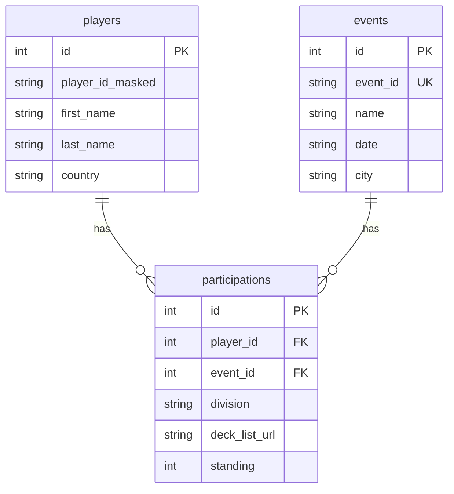

# Technical Design: Web UI + API

## Overview

**Purpose**: プレイヤー名から過去の大会参加履歴とデッキを検索できるWeb UIとAPIを提供する。

**Users**: ポケモンカード大会参加者が、対戦相手の過去のデッキ傾向を調査するために使用する。

**Impact**: Phase 1で構築したクローラー・DBインフラを活用し、新たにAPI層とフロントエンド層を追加する。既存のデータアクセス層（`src/db/`）を拡張し、検索機能を実装する。

### Goals
- プレイヤー名（First/Last name）による部分一致検索API
- Country、Divisionによるフィルタリング
- 開催日降順での参加記録表示
- 同名別人判別のための情報（Player ID、Division、Country）表示
- React + Vite によるシンプルな検索UI

### Non-Goals
- ユーザー認証・ログイン機能
- お気に入り・履歴保存機能
- リアルタイム更新・通知機能
- ネイティブモバイルアプリ（Web対応で十分）
- PC向けワイドレイアウト（モバイル幅で統一）

## Architecture

### High-Level Architecture


### Architecture Integration

- **既存パターン維持**: `src/db/` モジュール構造、ESM形式、Drizzle ORMパターンを踏襲
- **新規コンポーネント**: `src/api/` 層を追加、`web/` ディレクトリにフロントエンド配置
- **技術スタック整合**: TypeScript strict mode、Vitest、既存のLogger活用

### Technology Stack

| Layer | Technology | Rationale |
|-------|------------|-----------|
| API Framework | Hono | TypeScript-first、軽量、Node.js互換 |
| HTTP Adapter | @hono/node-server | better-sqlite3との同期API共存 |
| Frontend | React 18 + Vite | 高速開発、HMR、モダンビルド |
| State Management | React hooks | シンプルなUI、外部ライブラリ不要 |
| HTTP Client | fetch API | 標準API、追加依存なし |

### Key Design Decisions

#### Decision 1: Hono vs Express

- **Decision**: Hono を採用
- **Context**: 軽量なAPIサーバーが必要、TypeScript型推論を活用したい
- **Alternatives**: Express.js（エコシステム充実）、Fastify（高性能）
- **Selected Approach**: Honoは TypeScript-first で型推論が優秀、依存が少なく、Drizzleとの相性も良い
- **Rationale**: 既存プロジェクトの軽量志向と整合、better-sqlite3の同期APIと問題なく共存
- **Trade-offs**: Express比で情報量は少ないが、シンプルなAPIには十分

#### Decision 2: モノレポ構成

- **Decision**: `web/` サブディレクトリにフロントエンド配置
- **Context**: CLAUDE.mdで `web/` 構成が予定されている
- **Alternatives**: 別リポジトリ、npm workspaces
- **Selected Approach**: 単一リポジトリ内の `web/` ディレクトリに Vite プロジェクト配置
- **Rationale**: デプロイ・開発が簡潔、型定義の共有が容易
- **Trade-offs**: package.json が分離するため依存管理が二重化

#### Decision 3: CORS戦略

- **Decision**: 開発時はVite proxy、本番は同一オリジン
- **Context**: フロントエンド（5173）とAPI（3000）のポートが異なる
- **Selected Approach**: Viteの`server.proxy`設定で `/api` を localhost:3000 に転送
- **Rationale**: CORS設定の複雑さを回避、本番デプロイ時は静的ファイル配信と同一オリジン

## System Flows

### プレイヤー検索フロー


## Components and Interfaces

### API Layer

#### Search Service

**Responsibility & Boundaries**
- **Primary Responsibility**: プレイヤー検索クエリの実行と結果整形
- **Domain Boundary**: 検索ロジックのみ、DB操作は `src/db/` に委譲
- **Data Ownership**: 検索結果のDTO変換

**Dependencies**
- **Inbound**: Hono route handlers
- **Outbound**: `src/db/queries.ts`

**Service Interface**

```typescript
interface PlayerSearchParams {
  name: string;        // first_name と last_name 両方を検索
  country?: string;
  division?: 'Masters' | 'Senior' | 'Junior';
  limit?: number;
}

interface PlayerSearchResult {
  id: number;
  playerIdMasked: string;
  firstName: string;
  lastName: string;
  country: string;
  participationCount: number;
}

interface ParticipationWithEvent {
  id: number;
  eventName: string;
  eventDate: string | null;
  eventCity: string | null;
  division: string | null;
  deckListUrl: string | null;
  standing: number | null;
  playerIdMasked: string;
  country: string;
}

interface SearchService {
  searchPlayers(params: PlayerSearchParams): PlayerSearchResult[];
  getPlayerParticipations(playerId: number, division?: string): ParticipationWithEvent[];
}
```

#### API Routes

**API Contract**

| Method | Endpoint | Request | Response | Errors |
|--------|----------|---------|----------|--------|
| GET | `/api/players/search` | `?name=&country=&division=&limit=` | `PlayerSearchResult[]` | 400 (validation) |
| GET | `/api/players/:id/participations` | `?division=` | `ParticipationWithEvent[]` | 404 (not found) |
| GET | `/api/health` | - | `{ status: "ok" }` | - |

**Query Parameters**

```typescript
// GET /api/players/search
interface SearchQueryParams {
  name: string;        // 必須。first_name と last_name の両方を部分一致検索
  country?: string;    // 完全一致（オプション）
  division?: 'Masters' | 'Senior' | 'Junior' | 'all';  // デフォルト: all
  limit?: number;      // デフォルト: 100、最大: 500
}
```

**Search Logic**

```sql
-- 入力: name = "Yamada"
-- first_name または last_name のいずれかにマッチ
WHERE (first_name LIKE '%Yamada%' OR last_name LIKE '%Yamada%')
  AND (country = ? OR ? IS NULL)  -- countryフィルター（オプション）
```

**Validation Rules**

| Rule | Description | Error |
|------|-------------|-------|
| 名前必須 | `name` は必須（1文字以上） | 400: "name is required" |
| limit範囲 | 1〜500の範囲内 | 400: "limit must be between 1 and 500" |

```typescript
// GET /api/players/:id/participations
interface ParticipationsQueryParams {
  division?: 'Masters' | 'Senior' | 'Junior' | 'all';  // デフォルト: all
}
```

### Data Layer Extension

#### Search Queries Module

**Responsibility & Boundaries**
- **Primary Responsibility**: 検索用のDrizzle クエリ実装
- **Domain Boundary**: `src/db/` 配下、既存の operations.ts パターン踏襲

**Contract Definition**

```typescript
// src/db/queries.ts

interface SearchPlayersOptions {
  name: string;       // first_name OR last_name で部分一致検索
  country?: string;
  division?: string;
  limit?: number;     // デフォルト: 100
}

interface PlayerWithCount {
  id: number;
  playerIdMasked: string;
  firstName: string;
  lastName: string;
  country: string;
  participationCount: number;
}

interface ParticipationDetail {
  participationId: number;
  eventName: string;
  eventDate: string | null;
  eventCity: string | null;
  division: string | null;
  deckListUrl: string | null;
  standing: number | null;
  playerIdMasked: string;
  country: string;
}

// 名前でプレイヤーを検索（参加回数付き）
function searchPlayers(options: SearchPlayersOptions): PlayerWithCount[];

// プレイヤーの参加記録を取得（開催日降順）
function getParticipationsWithEvents(
  playerId: number,
  division?: string
): ParticipationDetail[];
```

### Frontend Layer

#### Design Principles

**Mobile-First Design**

| 方針 | 詳細 |
|------|------|
| ターゲットデバイス | スマートフォン（大会会場での利用想定） |
| レイアウト幅 | 最大 `400px`（PC表示時も中央配置） |
| レスポンシブ | 不要（モバイル幅で統一） |
| タッチ操作 | ボタン・リンクは十分な大きさ（44px以上） |

**Layout Strategy**

```css
/* コンテナはモバイル幅に固定 */
.app-container {
  max-width: 400px;
  margin: 0 auto;
  padding: 16px;
}
```

#### React Components

**Component Hierarchy**

```
App
├── SearchForm
│   ├── TextInput (name)       # 名前検索（first/last両方を検索）
│   ├── Select (country) [optional]
│   └── Select (division) [optional]
├── PlayerList
│   └── PlayerCard (repeating)
└── ParticipationList
    └── ParticipationCard (repeating)
```

**Component Responsibilities**

| Component | Responsibility |
|-----------|----------------|
| `App` | 状態管理、APIコール、レイアウト |
| `SearchForm` | 検索条件入力、バリデーション |
| `PlayerList` | 検索結果のプレイヤー一覧表示 |
| `PlayerCard` | 個別プレイヤー情報（名前、国、参加回数） |
| `ParticipationList` | 選択プレイヤーの参加記録一覧 |
| `ParticipationCard` | 大会情報、デッキリンク、順位表示 |

**State Model**

```typescript
interface AppState {
  // 検索条件
  searchParams: {
    name: string;      // first_name/last_name 両方を検索
    country: string;
    division: 'all' | 'Masters' | 'Senior' | 'Junior';
  };

  // 検索結果
  players: PlayerSearchResult[];
  isSearching: boolean;
  searchError: string | null;

  // 選択状態
  selectedPlayerId: number | null;
  participations: ParticipationWithEvent[];
  isLoadingParticipations: boolean;
}
```

## Data Models

### API Response Schemas

```typescript
// プレイヤー検索結果
interface PlayerSearchResponse {
  players: PlayerSearchResult[];
  total: number;
}

// 参加記録レスポンス
interface ParticipationsResponse {
  player: {
    id: number;
    firstName: string;
    lastName: string;
    playerIdMasked: string;
    country: string;
  };
  participations: ParticipationWithEvent[];
  total: number;
}
```

### 既存スキーマとの関係



## Error Handling

### Error Categories

| Category | HTTP Status | Response Format |
|----------|-------------|-----------------|
| Validation Error | 400 | `{ error: "Invalid parameters", details: [...] }` |
| Not Found | 404 | `{ error: "Player not found" }` |
| Server Error | 500 | `{ error: "Internal server error" }` |

### Validation Error Examples

```typescript
// 名前未指定
{ error: "name is required" }

// limit範囲外
{ error: "limit must be between 1 and 500" }
```

### Frontend Error Handling

- **検索エラー**: エラーメッセージ表示、再試行ボタン
- **ネットワークエラー**: 接続状態確認メッセージ
- **空結果**: 「該当するプレイヤーが見つかりません」表示

## Testing Strategy

### Unit Tests

| Module | Test Target | Test Cases |
|--------|-------------|------------|
| `queries.ts` | searchPlayers | 部分一致検索、フィルター組み合わせ、空結果 |
| `queries.ts` | getParticipationsWithEvents | 降順ソート、Division フィルター |
| API routes | Request validation | 不正パラメータ、境界値 |
| API routes | Response format | JSON構造、型整合性 |

### Integration Tests

| Test | Description |
|------|-------------|
| 検索→参加記録取得フロー | API経由で検索→詳細取得の一連の流れ |
| DB統合 | 実DB（テスト用）でのクエリ実行 |
| エラーハンドリング | 404、400レスポンスの検証 |

### E2E Tests (Frontend)

| Test | Description |
|------|-------------|
| 検索フロー | フォーム入力→検索→結果表示 |
| プレイヤー選択 | 一覧からクリック→参加記録表示 |
| デッキリンク | 外部リンクの正常動作確認 |

## Project Structure

```
PTCGOpponentChecker/
├── src/
│   ├── api/                    # 新規: API層
│   │   ├── index.ts            # Honoアプリ・サーバー起動
│   │   ├── routes/
│   │   │   └── players.ts      # プレイヤー検索ルート
│   │   ├── types.ts            # API型定義
│   │   └── *.test.ts
│   ├── db/
│   │   ├── queries.ts          # 新規: 検索クエリ
│   │   ├── queries.test.ts     # 新規: クエリテスト
│   │   └── (existing files)
│   └── (existing modules)
├── web/                        # 新規: フロントエンド
│   ├── src/
│   │   ├── App.tsx
│   │   ├── components/
│   │   │   ├── SearchForm.tsx
│   │   │   ├── PlayerList.tsx
│   │   │   ├── PlayerCard.tsx
│   │   │   ├── ParticipationList.tsx
│   │   │   └── ParticipationCard.tsx
│   │   ├── hooks/
│   │   │   └── usePlayerSearch.ts
│   │   ├── types.ts
│   │   └── main.tsx
│   ├── index.html
│   ├── package.json
│   ├── tsconfig.json
│   └── vite.config.ts
└── package.json                # scripts追加
```

## npm Scripts Addition

```json
{
  "scripts": {
    "dev:api": "tsx src/api/index.ts",
    "dev:web": "cd web && npm run dev",
    "dev": "concurrently \"npm run dev:api\" \"npm run dev:web\""
  }
}
```
